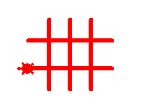
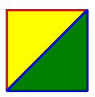
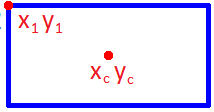
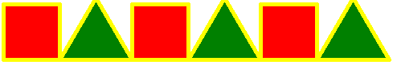
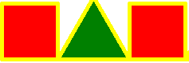
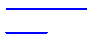
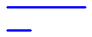
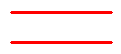

# Вариант 1

## Задача 1.1 (2 балла)

Напишите программу. Программа рисует:

## Задача 1.2 (2 балла)

Напишите функцию **fig(size)**. Она рисует квадрат. Сторона квадрата размера **size**

## Задача 1.3 (2 балла)

Напишите функцию **fig(x1, y1, xc, yc)**. Она рисует прямоугольник 
с центром в точке (xc, yc) и левой верхней точкой в (x1, y1).

## Задача 1.4 (3 балла)

Написать функцию **uzor(size, n)**. Она рисует узор из n **пар** фигур.

uzor(50, <b>3</b>) нарисует (**3 раза по 2 фигуры**):

**+3 балла, если функция умеет рисовать любое количество фигур**

uzor(50, <b>3</b>) нарисует (**3 фигуры**):

## Задача 1.5 (2 балла)

Написать функцию **fig3(size1, size2)**

* Функция рисует 2 линии. Цвет линий синий.
* Большая линия сверху, маленькая линия снизу.
* **+1 балл**, если линии одинаковые, то цвет красный.

| fig3(100, 50) | fig3(30, 100) | Дополнительно: fig3(100, 100) |
|----|----|----|
|  |    |  |

