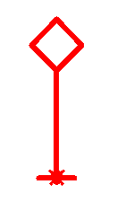
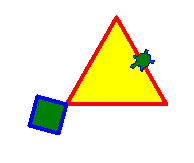
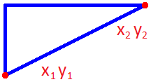
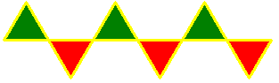
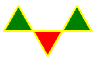
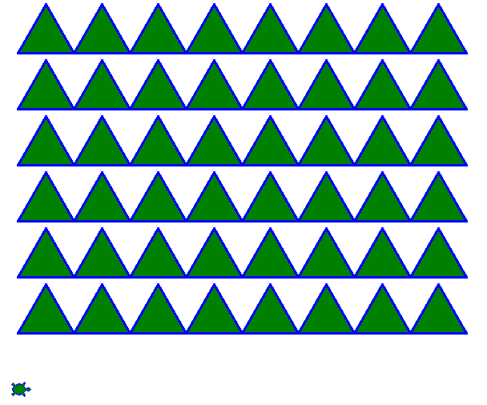
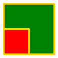
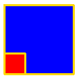
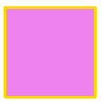

# Вариант 3

## Задача 3.1 (2 балла)

Напишите программу. Программа рисует:

## Задача 3.2 (2 балла)

Напишите функцию **fig(size1, size2)**. 

* Сторона квадрата размера **size1**.
* Сторона треугольника размера **size2**.

## Задача 3.3 (2 балла)

Даны (x1, y1) левая нижняя и (x2, y2) правая верхняя точка прямоугольного треугольника.

Напишите функцию **fig(x1, y1, x2, y2)**. Она рисует прямоугольный треугольник. 

Рисовать только треугольник. Писать `x1 y1 x2 y2` НЕ надо.

## Задача 3.4 (3 балла)

Написать функцию **uzor(size, n)**. Она рисует узор из n **пар** фигур.

uzor(50, <b>3</b>) нарисует (**3 раза по 2 фигуры**):

**+3 балла, если функция умеет рисовать любое количество фигур**

uzor(50, <b>3</b>) нарисует (**3 фигуры**):

## Задача 3.5 (5 баллов)

Написать функцию **grid(n, m)**. Функция `grid(6, 8)` нарисует:

Подсказка: рисовать линии, а не квадраты.

## Задача 3.6 (2 балла)

Написать функцию **fig2(size1, col1, size2, col2)**

* Функция рисует 2 квадрата.
* Один с длиной стороны size1 и цвет col1.
* Второй с длиной стороны size2 и цвет col2.

Нарисовать **сначала большой, потом маленький**. Все квадраты должны быть видны.

**+1 балл, если квадраты одинакового размера, их цвет violet.**

| `fig2(100, 'green', 50, 'red')` | `fig2(30, 'red', 100, 'blue')` | Дополнительно: `fig2(100, 'blue', 100, 'green')` |
|----|----|----|
|  |    |  |

