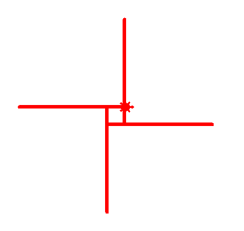
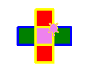
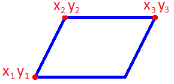
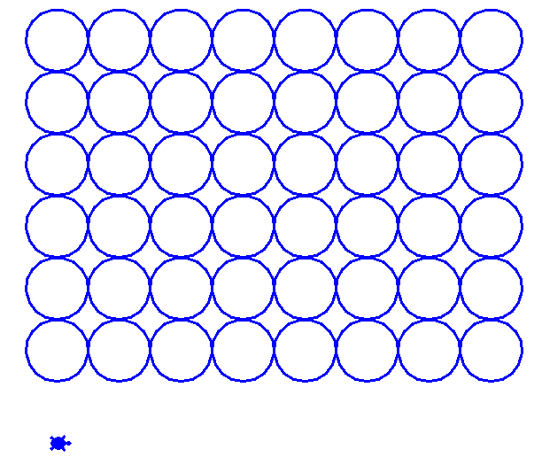
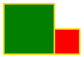
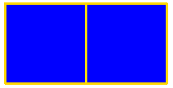

# Вариант 5

## Задача 5.1 (2 балла)

Напишите программу. Программа рисует:

## Задача 5.2 (2 балла)

Напишите функцию **fig(size)**. 

* сначала рисуем прямоугольник со сторонами `size` и `2*size`.
* потом рисуем треугольник со сторонами `3*size`.

## Задача 5.3 (2 балла)

Дан **параллелограмм**. (x1, y1) левая нижняя точка, (x2, y2) и (x3, y3) верхние точки **параллелограмма**.

Напишите функцию **fig(x1, y1, x2, y2, x3, y3)**. Она рисует **параллелограмм** по 3 точкам. 

Рисовать только параллелограмм. Писать `x1 y1 x2 y2 x3 y3` НЕ надо.

## Задача 5.4 (3 балла)

Написать функцию **uzor(size, n)**. Она рисует узор из n **пар** фигур.

uzor(50, <b>3</b>) нарисует (**3 раза по 2 фигуры**):

**+3 балла, если функция умеет рисовать любое количество фигур**

uzor(50, <b>3</b>) нарисует (**3 фигуры**):

## Задача 5.5 (5 баллов)

Написать функцию **grid(n, m)**. Функция `grid(6, 8)` нарисует:

## Задача 5.6 (2 балла)

Написать функцию **fig2(size1, size2)**

* Функция рисует 2 квадрата.
* Маленький квадрат красный.
* Большой квадрат зеленый.

**+1 балл, если квадраты одинакового размера, их цвет синий.**

| `fig2(100, 50)` | `fig2(30, 100)` | Дополнительно: `fig2(100, 100)` |
|----|----|----|
|  |    |  |

