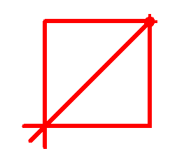
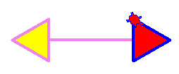
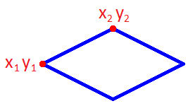
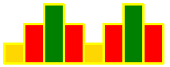
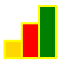
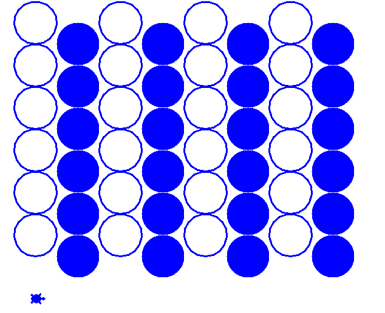
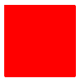

# Вариант 7

## Задача 7.1 (2 балла)

Напишите программу. Программа рисует:

## Задача 7.2 (2 балла)

Напишите функцию **fig(size)**. 

Она рисует

* треугольники со сторонами `size`.
* расстояние между треугольниками `2*size`.

## Задача 7.3 (2 балла)

Дан **ромб**. (x1, y1) левая нижняя точка, (x2, y2)  верхняя точка **ромба**. Его диагонали - горизонтальная и вертикальная линия.

Напишите функцию **fig(x1, y1, x2, y2)**. Она рисует **ромб** по 2 точкам. 

Рисовать только ромб. Писать `x1 y1 x2 y2` НЕ надо.

## Задача 7.4 (3 балла)

Написать функцию **uzor(size, n)**. Она рисует узор из n **пар** фигур.

uzor(50, <b>2</b>) нарисует (**2 раза по 4 фигуры**):

**+3 балла, если функция умеет рисовать любое количество фигур**

uzor(50, <b>3</b>) нарисует (**3 фигуры**):

## Задача 7.5 (5 баллов)

Написать функцию **tri(size1)**. Функция `*tri(size1)` рисует 1 треугольник со стороной `ышяу`

## Задача 7.6 (2 балла)

Написать функцию **fig2(size1, size2)**

* Функция рисует прямоугольник со сторонами size1 и size2.
* Если `size1 > size2`, то прямоугольник синий.
* Иначе прямоугольник зеленый.

**+1 балл, если квадрат, то цвет красный.**

| `fig2(100, 50)` | `fig2(50, 100)` | Дополнительно: `fig2(100, 100)` |
|----|----|----|
|  |    |  |

